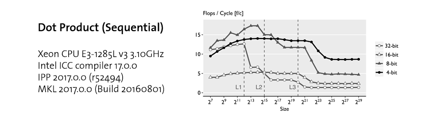
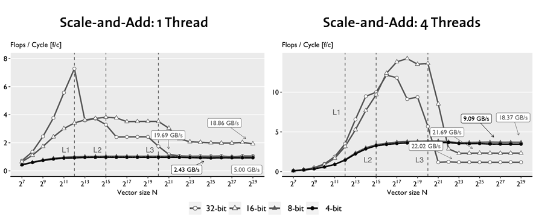
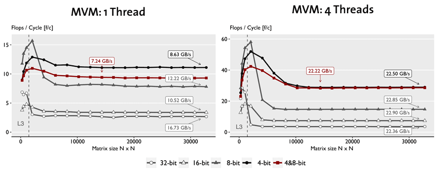

Clover: Quantized 4-bit Linear Algebra Library for `AVX2`
=========================


**Clover** is a new library for the efficient computation on low-precision data, providing mathematical routines required by fundamental methods in optimization and sparse recovery. Our library faithfully implements variants of stochastic quantization and supports 4-bit quantized and 8-bit quantized data formats and demonstrats that 4-bit can be implemented efficiently using Intel `AVX2` despite the lack of native support for this data format. 


**Clover** also supports 16-bit half precision and 32-bit single precision IEEE-754 formats that are natively supported by Intel processors. Experimental results with dot product, matrix-vector multiplication, gradient descent (GD), and iterative hard thresholding (IHT) illustrate the attainable speedups, in many cases close to linear in the reduction of precision because of reduced data movement. 

This library is implemented by [Alen Stojanov](https://astojanov.github.io/) and [Tyler Michael Smith](https://github.com/tlrmchlsmth) as a research project at [Department of Computer Science at ETH Zurich](https://www.inf.ethz.ch/), supervised by [Dan Alistarh](https://people.csail.mit.edu/alistarh/) and [Markus Püschel](https://www.inf.ethz.ch/personal/markusp/).

Building Clover Library and `clover` executable
---------------------

Clover is implemented in `C++` using `C++11` standard, and tested on Mac OS X and Linux. To compile Clover, the following dependencies must be met:

1. [AVX2](https://en.wikipedia.org/wiki/Advanced_Vector_Extensions#Advanced_Vector_Extensions_2)-enabled machine, supporting [FMA](https://en.wikipedia.org/wiki/FMA_instruction_set), [F16C](https://en.wikipedia.org/wiki/F16C) and [RDRAND](https://en.wikipedia.org/wiki/RdRand) instructions sets.
2. Intel [ICC](https://software.intel.com/en-us/c-compilers) compiler, `17.0.0.20160721` or later
3. Parallel Intel [Math Kernel Library](https://software.intel.com/en-us/mkl), `2017.0.0` or later
4. Intel [Integrated Performance Primitives](https://software.intel.com/en-us/intel-ipp), `2017.0.0 (r52494)` or later
5. [CMake](https://cmake.org/download/) `3.0.2` or later

Note that while it is possible to use other [OpenMP](https://www.openmp.org/)-enabled compilers to build Clover, we only aimed at developing this prottype using Intel ICC, due to its research character, and did not attempt providing cross-compiler and cross-environment support nor performance guarantees. 

Once all dependencies are met, the following steps can be used to compile Clover:

```
git clone https://github.com/astojanov/Clover
cd Clover
mkdir build
cd build
CC=icc CXX=icpc cmake ..
cd ..
cmake --build build --config Release
```

Running `clover` executable
---------------------

Once successfully compiled, `clover` runs in different modes:

**Validation** which validates the implemented code:

```
./bin/clover -v
```

Note that the 4-bit and the 8-bit data formats perform stochastic rounding, which is built using presudo random number generator such as [XORShift](https://github.com/lemire/SIMDxorshift). As a result, some of the routines can only be validated if the strochastic rounding is diabled. To do so, we need to recompile, namely run:

```
CC=icc CXX=icpc cmake -DSTOCHASTIC_ROUNDING_DISABLED=1 ..
```

**Performance Analysis**

```
./bin/clover -p
```

Once invoked, the `clover` executable will output the performance profiles for most routines supported by the library, their runtime in cycles, approximate bandwidth usage as well as relative speed up over the 32-bit version.


Using Clover Library
--------------------

The entire Clover library is self-contained in the header files located in the `include` folder. Therefore, it is sufficent to include the headers to start developing code. The code below illustrates how to create 32-bit vectors, quantize them into 4-bit precision, and compute their dot product, outputing the result on the screen:

```cpp
#include <CloverVector32.h>
#include <CloverVector4.h>

void example ()
{
    //
    // Create two 32-bit vectors of size 128
    //
    const int n = 128;
    CloverVector32 a_vector_32bit(n);
    CloverVector32 b_vector_32bit(n);
    //
    // Initialize the two
    //
    float * a = a_vector_32bit.getData();
    float * b = b_vector_32bit.getData();
    for (int i = 0; i < n; i += 1) {
        a[i] = 1; // a_vector_32bit.set(i, 1);
        b[i] = 2; // b_vector_32bit.set(i, 2);
    }
    //
    // Create 4-bit vectors
    //
    CloverVector4 a_vector_4bit(128);
    CloverVector4 b_vector_4bit(128);
    //
    // Quantize the 32-bite vectors into 4-bit vectors
    //
    a_vector_4bit.quantize(a_vector_32bit);
    b_vector_4bit.quantize(b_vector_32bit);
    //
    // Calculate the dot product and output
    //
    float dot = a_vector_4bit.dot(b_vector_4bit);
    std::cout << "The dot product is: " << dot << std::endl;
}
```

Clover Library Internals
--------------------

Functionality for quantized 4-bit linear algebra operations is provided by the `CloverVector4` and `CloverMatrix4` containers. `CloverVector4` contains a vector represented in a quantized 4-bit format. The values and the scaling factors are stored in separate contiguous blocks of memory, such that sub-vectors of length 64 share the same scale.



An illustration of the memory layout of a `CloverVector4` container is shown above. Each value in the vector is stored as a two’s complement in a 4-bit [nibble](https://en.wikipedia.org/wiki/Nibble). The x86 architecture uses byte addressing, so we address each the nibbles in software. We accomplish this explicitly in the application logic, storing two consecutive nibbles in a byte. As a result, the values in a `CloverVector4` of length n are represented as an array of n/2 bytes. `CloverVector8` shares the same design principles. `CloverVector16` and `CloverVector32` containers do not have scales, and the data layout is not organized into blocks. Each container implements the following routines:

- `.quantize`: That converts 32-bit vector intro 4/8/16-bit quantized vector.
- `.restore`: That converts the quantized vector into 32-bit vector.
- `.dot`: Dot Product Routine.
- `.scaleAndAdd`: Scale and Add routine (equvalent to [AXPY](http://www.netlib.org/blas/))
- `.threshold(K)`: Thresholding routine that drop all but the higest `K` elements in magnitude.

The matrix container, namely `CloverMatrix4`, is represented similarly. The values and scales are stored as separate contiguous blocks of memory, both in row-major order. Sub-matrices of size 64 × 64 share the same scale. The length of each vector is padded to 128 elements, and the row and column size of the matrix is also padded to 128. Similar design decisions are made for `CloverMatrix8`. `CloverMatrix16` and `CloverMatrix32` do not contain scales. The following routines are available:

- `.quantize`: That converts 32-bit matrix intro 4/8/16-bit quantized matrix.
- `.restore`: That converts the quantized matrix into 32-bit matrix.
- `.mvm`: Matrix Vector Multiplication routine.
- `.transpose`: Routine to transpose the matrix.

Each of these routines are implemented using SIMD code as much as possible. For each routine we provide scalar implementation having the same nomenclature, following `_scalar` for testing and validation purposes. When possible, we parallize the code using OpenMP and provide the same routines in threaded code folloging the `_parallel` suffix.


Performance Profile
-------------------

We evaluated our implementation on an [Intel Xeon CPU E3-1285L v3 3.10GHz](https://ark.intel.com/products/75466/Intel-Xeon-Processor-E3-1285L-v3-8M-Cache-3_10-GHz) Haswell with 32GB of RAM and 25.6 GB/s bandwidth to main memory, running Debian GNU/Linux 8 (jessie), kernel `3.16.43-2+deb8u3`. We use the Intel ICC compiler `17.0.0`, Intel IPP `2017.0.0 (r52494)`, and Intel MKL `2017.0.0 (Build 20160801)`. We use `RDTSC` to measure the cycle count for each test, performing 15 repetitions with warm cache, and using the median as a result. To avoid the effects of frequency scaling and resource sharing on the measurements, Turbo Boost and Hyper-Threading are disabled.

For each routine we derive a pseudo flop count, using the number of additions and multiplications required to perform the mathematical operations, and report our results in flops per cycle (F/C). The flop count for dot product and scale and add is `2 * n` and for MVM it is `2 * n * n`.

**Dot Product.** The figure below shows the performance profile of the dot product. When the data fits in L1 and L2 cache the 32-bit version is much faster than 4-bit because the entire computation is done using native instructions without bit-unpacking. Once the data exceed L3 cache, 4-bit is fastest since the dot product is memory bound: data movement from RAM becomes the bottleneck. The speed-up is up to 6x over the 32-bit version. 


**Scale and add.** Similar to the dot product, the plots below shows that the 32-bit and 16-bit implementations are faster than 4-bit and 8-bit within cache for the same reasons. However, even outside L3 cache, 4- and 8-bit are only able to match the 32-bit implementation due to the higher overhead. This is reflected in the low bandwidth used. As a result, parallelization yields near-linear speed-up for 4-bit and near none for 32-bit, making 4-bit about 3x faster.



**MVM.** In the figure below we compare our sequential and parallel implementations of MVM, respectively, for each datatype, including the mixed 4,8-bit MVM. For the sequential case, for problems that do not fit in cache, we see that pure 4-bit is about 4.6x faster than 32-bit but uses only one third of the available bandwidth, and the mixed 4-bit and 8-bit MVM is noticeable slower. However, once parallelized, all version exhaust the available bandwidth and thus reach a speedup linear in the precision reduction. The mixed 4,8-bit MVM is now as fast as the 4-bit version since the bottleneck is loading the matrix.



# Contribution policy

Contributions via GitHub pull requests are gladly accepted from their original author. 

# License

This code is open source software licensed under the [Apache 2.0 License](https://www.apache.org/licenses/LICENSE-2.0.html). Feel free to use it accordingly.